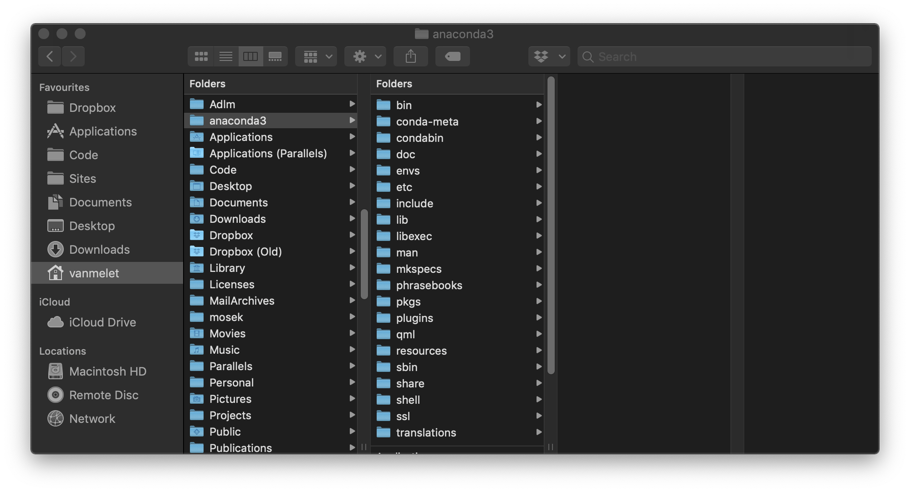
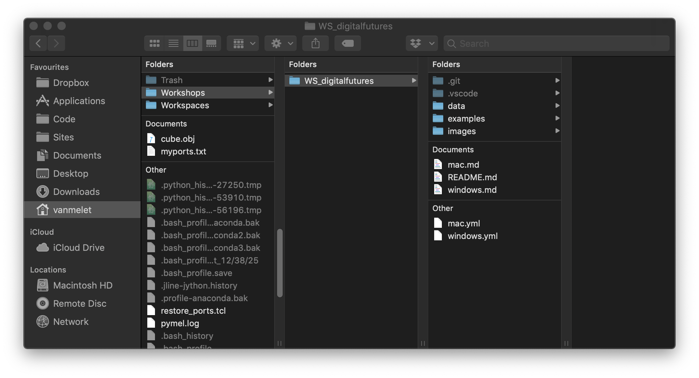
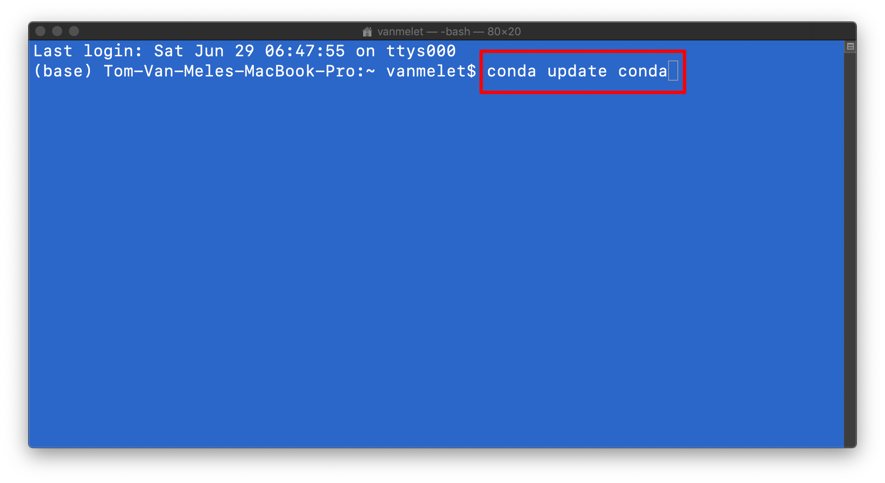
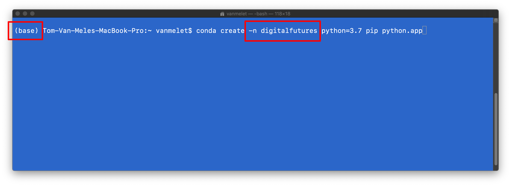
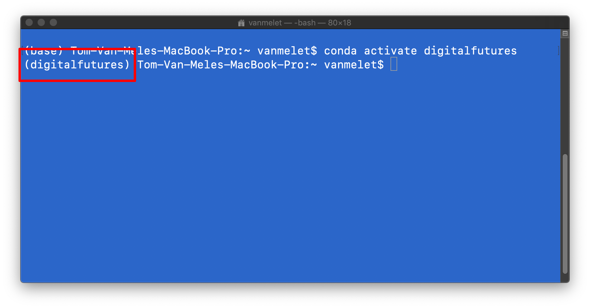

# Getting started on Mac

## Requirements

* [Anaconda 3 (with Python 3.7)](https://repo.anaconda.com/archive/Anaconda3-2019.03-MacOSX-x86_64.pkg)
* [Rhino](https://www.rhino3d.com/download)
* [Visual Studio Code](https://code.visualstudio.com/)
* [Git](https://git-scm.com/downloads) (or XCode command line tools)

Make sure to install Anaconda on your home drive, which should be the recommended location. 



## Preparation

Download the workshop files from the GitHub repo at https://www.github.com/BlockResearchGroup/WS_digitalfutures. Unzip the archive at a location on your computer that is easily accessible. The recommended location is in a folder on your home drive.



## Installation

Please use the Terminal app to execute the various steps of the installation procedure. To open the Terminal app, hit `COMMAND+SPACE` and type "Terminal".

**1. Update conda**

Update `conda`, the package and environment manager of Anaconda.

```bash
conda update conda
```



**2. Register conda-forge**

COMPAS is available through the `conda-forge` channel. Add the channel to your configuration.

```bash
conda config --add channels conda-forge
```

**3. Create a virtual environment**

Create a virtual environment for this workshop named "digitalfutures" running on Python 3.7 and install `pip` and the Python framework build (`python.app`).

```bash
conda create -n digitalfutures python=3.7 pip python.app
```



**4. Activate the environment**

Activate the "digitalfutures" environment such that all following commands are executed within the context of this environment.

```bash
conda activate digitalfutures
```

> When the "digitalfutures" environment is active, the name "digitalfutures" will appear in parentheses in front of the prompt.



**5. Install COMPAS**

Install the core Python packages of the COMPAS framework in the active environment.

```bash
conda install COMPAS>=0.7.0
```

**6. Install compas_fofin**

Install `compas_fofin`, a Python package for designing cable-net structures.

```bash
pip install git+https://www.github.com/BlockResearchGroup/compas_fofin.git#egg=compas_fofin
```

**7. Download compas_fofin-UI**

Download the Rhino UI for `compas_fofin` from the GitHub repo: https://www.github.com/BlockResearchGroup/compas_fofin-UI. For example, to the same location as the workshop files.

## Rhino Configuration

**1. Install COMPAS packages**

With the "digitalfutures" environment active, install COMPAS and `compas_fofin` for Rhino.

```bash
python -m compas_rhino.install -p compas compas_rhino compas_fofin
```

The packages will become available the next time you start Rhino.

**2. Install compas_fofin-UI**

Navigate to the location where you downloaded and unzipped the `compas_fofin-UI` repo.

```bash
python -m compas_rhino.install_plugin FOFIN{7ea0207d-965a-4982-abc7-f60810ae2626}
```

